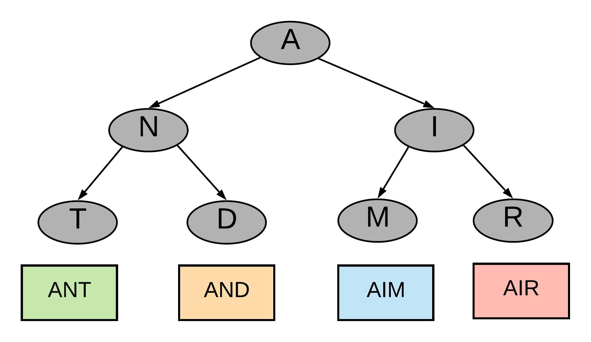

so, it's just a modified DFS
tends to be recursive, like DFS

look for words like: permutation


>Backtracking is a general algorithm for finding all (or some) solutions to some computational problems (notably Constraint satisfaction problems or CSPs), which **_incrementally builds candidates to the solution_** and abandons a candidate ("backtracks") as soon as it determines that the candidate cannot lead to a valid solution.


```js
function backtrack(candidate) {
	let path = [];
	
	if(findSolution(candidate)) {
		output(candidate);
		return;
	}
	
	for(let nextCandidate of candidates)  {
		if(isValid(list[i])) {
			path.push(nextCandidate); 
			backtrack(nextCandidate); // explore depth
			path.pop(); // back track last (aka current next)
		}
		
	}
}
```




Conceptually, backtracking can be thought of as tree traversal. In the pic above, look for "AIM". To save some time, you'd wanna skip over the first subtree because it's obviously not a match. Enter...backtracking! yaaayyyyyy


