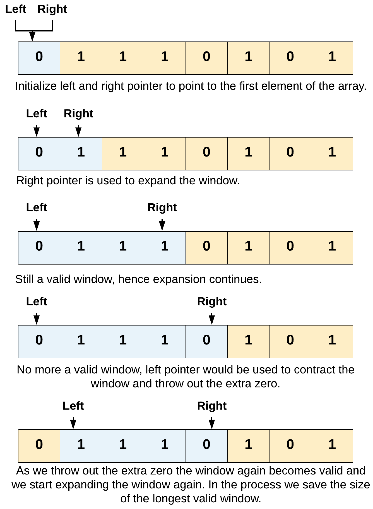

# Two Pointers Notes

## Two Pointer Types
| Type | Description |
| --- | --- |
| Fast & Slow Pointer | Both pointers start at the same place, BUT the fast pointer's position moves faster through the array. <br> **Good for:** finding cycles and midpoints.  |
| Opposite Ends (Left+Right) | These pointers start at opposite ends of the structure. <br> **Good for:** comparisions and swapping |
| Sliding Window | **Good for:** longest subarray |


<details>
  <summary> Fast & Slow Pointer Example </summary>

```js

// find the mid point of a singlely linked list

function middleNode(head) {
    let slow = fast = head; 
    
    while( fast != null && fast.next != null ) {
        slow = slow.next;
		// will get to the end 2x as fast
        fast = fast.next.next;
    }
    
    return slow;
};

```

</details>

<details>
  <summary>Left + Right Pointer Example</summary>
  
  ```js
function isPalindrome(str) {
	let left = 0,
		right = str.length - 1;

	while(left < right) {
		if(str[left] !== str[right]) {
            return false
        }

		left++;
		right--;
	}
    
    return true;
}
```
</details>

<details>
  <summary>Sliding Window</summary>
  
  > Context: find the longest substring w/ only one `0`. LC #1004

  

  There is a `left` and `right` pointer. The `right` is used to **expand** the window, while the `left` is used to **contract** the window. 

  Expand the window until we hit the limit of `0`s. Then, contract the window to observe the limit. 

  ```js
function name(array) {
	  let left = right = 0;
    
    // BASIC sliding window
    while(right < array.length) {
        
        if ( array[right] === 0 ) {
            left++;
        }
        
        right++;
    }
    
    // diff == length of window
    return right - left;
}
```
</details>
